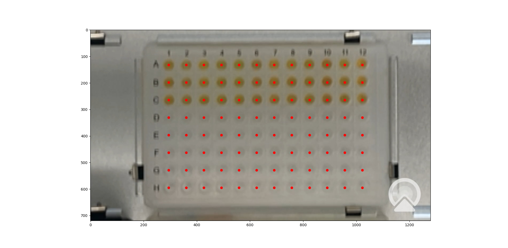

Basic Example
=============

Walkthrough
-----------
This section walks through a basic example of how to use OptoBot to implement
an automated experimental optimisation loop for a colorimetric experiment.
In this example, the experiment is mixing red, yellow and blue (RYB) food 
colouring along with water to produce a pre-defined target colour. 
One thing to note is that the water acts as a dilution agent and will not be 
included as a parameter in the search space for the optimisation algorithm.
Instead, the volume of water is calculated as the remaining volume in a well 
after the red, yellow and blue food colouring volumes have been calculated. 
The experimental setup is shown below.

.. figure:: _static/example-setup.png
    :alt: Example Experimental Setup
    :align: center
    :width: 350

    Figure: An example experimental setup for a colorimetric experiment.

We start with importing the required classes and functions from the ``optobot`` 
package.
The first import includes the ``optobot.automate.OptimisationLoop`` class which 
implements the main automated experimental optimisation loop.
The second import includes the ``optobot.colorimetric.get_colours`` function 
which handles capturing an image of the OT-2's deck using a camera and 
retrieving the RGB values of wells in the image.

.. code-block:: python

    from optobot.automate import OptimisationLoop
    from optobot.colorimetric.colours import get_colours

Next, we define the experimental setup and configuration.
This starts with setting the experimental parameters and experimental response 
variables.
For optimisation, the target experimental response, the experimental 
parameter search space and a relative tolerance are defined. 
The relative tolerance is set so that the optimisation loop stops if a measured 
experimental response is close enough to the target experimental response.
Note that the dilution agent should be entered as the first experimental 
parameter because the first element will not considered as part of the search 
space for optimisation. 

.. code-block:: python

    # Define an experiment name.
    experiment_name = "colour_experiment"

    # Define the experimental parameters.
    # In this experiment, these are RYB colour pigments and water.
    # NOTE: The dilution agent should be entered as the first parameter.
    liquid_names = ["water", "red", "yellow", "blue"]

    # Define the measured parameters.
    # In this experiment, these are the RGB values of the experimental products.
    measured_parameter_names = ["measured_red", "measured_green", "measured_blue"]

    # Set a target measurement.
    # In this experiment, this a set of defined RGB values.
    target_measurement = [
        114.8412698,
        96.1111111,
        37.84126984,
    ]  # Taken from a previous experiment.

    # Set a relative tolerance (percentage). 
    # If a measurement is within the tolerance from the target, the optimisation loop is stopped.
    relative_tolerance = 0.05

    # Define the search space of the experimental parameters.
    # In this experiment, this is the range of volumes for RYB colour pigments.
    search_space = [[0.0, 30.0], [0.0, 30.0], [0.0, 30.0]]

Next, we define the well plate configuration inside the Opentrons OT-2. 
This includes well plate dimensions and well plate location on the OT-2's 
deck.
Note that multiple well plates can be used through defining a list of well 
plate locations. 
If multiple well plate locations are defined, each well plate is used in a 
sequential manner.
We also define the maximum liquid volume of each well.

.. code-block:: python

    # Define the well plate dimensions.
    wellplate_size = 96
    wellplate_shape = (8, 12)  # As (rows, columns).

    # Define the total volume in a well.
    total_volume = 90.0

    # Define the location of the wellplate in the Opentrons OT-2.
    # In this experiment, this is slot 5.
    # NOTE: More than one well plate can be used.
    # NOTE: For example, slots 5 & 8 -> [5, 8]
    wellplate_locs = [5]

Next, we define the population size and the number of iterations for the 
optimisation algorithm.
Note that we should make sure that the combination of population size and 
number of iterations do not exceed the total number of available wells.

.. code-block:: python

    # Define the population size for optimisation.
    # In this experiment, this is defined as 12 -> 12 wells/columns.
    population_size = 12

    # Define the number of iterations for optimisation.
    # In this experiment, this is defined as 8 -> 8 rows.
    num_iterations = 8

    # Check that the number of iterations and population size are valid.
    if population_size * num_iterations > wellplate_size * len(wellplate_locs):
        print("error: not enough wells for defined population and iteration size")
        sys.exit(1)

Next, we define an objective function for experimental optimisation. 
In this example, we use the squared Euclidean distance between the target RGB 
values and the measured RGB values as the objective function.

.. math:: 
    
    {||x - y||}^{2} = \sum_{i} (x_{i} - y_{i})^{2} 

.. code-block:: python

    # Define an objective function for optimisation.
    def objective_function(measurements):
        """
        The objective function to be optimised.

        In this experiment, this calculates the squared Euclidean distance
        between the target RGB value and the measured RGB values.

        Parameters
        ----------
        measurements : np.ndarray
            The measured parameter values of the experimental products.

        Returns
        -------
        errors : np.ndarray
            The errors between the target value and the measured values.
        """

        errors = ((measurements - target_measurement) ** 2).sum(axis=1)
        return errors

Next, we define a measurement function for measuring the experimental 
products between each iteration of optimisation. 
As this example is a colorimetric experiment, we can utilise the 
``optobot.colorimetric.get_colours`` function to handle the entire process of 
capturing an image of the OT-2's deck and retrieving the RGB values of the 
experimental products.
Note that a measurement function does not have to be defined if a manual 
measurement process is used between iterations of optimisation.
However, a manual measurement process will require manual inputs of the 
measured experimental response variables.
A custom measurement function that interfaces with other equipment can also be 
used instead of the ``get_colours`` function to measure different experimental 
response variables.

.. code-block:: python

    # Define a measurement function for measuring experimental products.
    # NOTE: A measurement function does not have to be defined if measurement input is manual.
    def measurement_function(
        liquid_volumes,
        iteration_count,
        population_size,
        num_measured_parameters,
        data_dir,
    ):
        """
        The measurement function for measuring experimental products.

        In this experiment, this uses the "get_colours" function from the
        "optobot.colorimetric.colours" sub-module. The "get_colours" function
        uses a webcam pointing at the OT-2 deck to take a picture and retrieve
        the RGB values of the experimental products.

        Parameters
        ----------
        liquid_volumes : np.ndarray
            The liquid volumes of the experimental parameters used to generate 
            the experimental products in the current iteration.

        iteration_count : int
            The current iteration.

        population_size : int
            The population size.

        num_measured_parameters : int
            The number of measured parameters.

        data_dir : string
            The directory for storing the experimental data.

        Returns
        -------
        np.ndarray, float[population_size, num_measured_parameters]
            The measured parameter values of the experimental products.
        """

        return get_colours(
            iteration_count, population_size, num_measured_parameters, data_dir
        )

To finalise, we initialise an instance of the ``optobot.automate.OptimisationLoop`` 
class with the variables and functions we have defined.
We then call the ``OptimisationLoop.optimise`` class method to begin the 
automated optimisation loop.
Note that we use *Particle Swarm Optimisation* in this example, but 
*Bayesian Optimisation* can also be used through setting the ``optimiser`` 
parameter to "GP" for *Gaussian Process* as the acquisition function or "RF" 
for *Random Forest* as the acquisition function.

.. code-block:: python

    # Define the automated optimisation loop.
    model = OptimisationLoop(
        objective_function=objective_function,
        liquid_names=liquid_names,
        measured_parameter_names=measured_parameter_names,
        target_measurement = target_measurement,
        population_size=population_size,
        name=experiment_name,
        measurement_function=measurement_function,
        wellplate_shape=wellplate_shape,
        wellplate_locs=wellplate_locs,
        total_volume=total_volume,
        relative_tolerance= relative_tolerance,
    )
    # Start the optimisation loop.
    # In this experiment, Particle Swarm Optimisation is used.
    model.optimise(search_space, optimiser="PSO", num_iterations=num_iterations)

Once the optimisation loop has started, an OT-2 protocol script will be 
generated with the first set of experimental parameter values and the following 
text will be outputted to the command line. 
The user should upload and run the OT-2 protocol script using the 
`Opentrons App <https://opentrons.com/ot-app>`_.

.. code-block:: text

    2025-04-06 22:00:00,000 - pyswarms.single.global_best - INFO - Optimize for 8 iters with {'c1': 0.3, 'c2': 0.5, 'w': 0.1}
    pyswarms.single.global_best:   0%|                                                                                        |0/8
    Upload script, wait for robot, and then press any key to continue: 

After the OT-2 is finished with the protocol, the user should continue the 
program which will result in the measurement function being called.
In this example, this is the ``get_colours`` function which will first capture 
an image of the OT-2's deck.
A prompt for a threshold parameter, which controls how sensitive the contour 
detection algorithm should be, will then appear on the command line.
A higher threshold will make the contour detection algorithm more sensitive and 
vice versa. 
The contour detection algorithm will then attempt to locate the wells in the 
image of the OT-2's deck and the user will be prompted to either accept the 
results or redo the contour detection algorithm.
The user can also decide to use a manual extrapolated grid algorithm instead of 
the contour detection algorithm to locate the wells in the image.
To use the manual extrapolated grid algorithm, the user will be prompted to 
click on two consecutive wells in the image from which an extrapolated grid 
of well locations is calculated.
This process can be repeated until the wells in the image are located to the 
user's desired precision.

.. code-block:: text

    Type threshold (Default is 30):
    30

    Happy with detection?
    type "y" if you are, "n" to try again, and "b" to use the manual clicking detection
    b
    Happy with the grid? [y/n] y

    Figure: An example image of located wells using the extrapolated grid algorithm.

Once an image with located wells has been accepted, the RGB values of the 
experimental products from the current iteration of optimisation will be fed to 
the optimisation algorithm.
If the target experimental response has not been achieved, the optimisation 
algorithm will generate a new OT-2 protocol script with the next experimental 
parameter values and the following text will be outputted to the command line.
The process described in the above paragraphs is then repeated until either the 
target experimental response is achieved or the defined number of optimisation 
iterations are completed.

.. code-block:: text

    pyswarms.single.global_best:  12%|██████████████████                                                                        |1/8, best_cost=17362.0
    Upload script, wait for robot, and then press any key to continue: 

If a measured experimental response falls within the defined tolerance from the 
target experimental response, the target experimental response is considered to 
be achieved.
The optimisation process is stopped and the following text will be outputted to 
the command line.

.. code-block:: text

    pyswarms.single.global_best:  75%|█████████████████████████████████████████████████████████████████████████████████████            |6/8, best_cost=1.08
    Upload script, wait for robot, and then press any key to continue:

    Stopping the optimization - measurements have been found that are close to the target (within 5.0%):
    - measurement = [14.43234437 20.13919216 14.3225938 ], percent differences of each value to the target values = [3.09 0.7  4.52]%

*Note: All measured and generated data is saved to a folder with the experiment name.*

Full Script
-----------
The full script for the example is given below.

.. code-block:: python

    """
    An example script showing how to use the optobot package. This script uses the
    optobot package in the context of a colour mixing experiment, where red, yellow 
    and blue (RYB) liquid pigments are mixed to create a target colour.
    """

    # Import required libraries.
    import sys

    from optobot.automate import OptimisationLoop
    from optobot.colorimetric.colours import get_colours

    def main():
        # Define an experiment name.
        experiment_name = "colour_experiment"

        # Define the experimental parameters.
        # In this experiment, these are RYB colour pigments and water.
        # NOTE: The dilution agent should be entered as the first parameter.
        liquid_names = ["water", "red", "yellow", "blue"]

        # Define the measured parameters.
        # In this experiment, these are the RGB values of the experimental products.
        measured_parameter_names = ["measured_red", "measured_green", "measured_blue"]

        # Set a target measurement.
        # In this experiment, this a set of defined RGB values.
        target_measurement = [
            114.8412698,
            96.1111111,
            37.84126984,
        ]  # Taken from a previous experiment.

        # Set a relative tolerance (percentage). 
        # If a measurement is within the tolerance from the target, the optimisation loop is stopped.
        relative_tolerance = 0.05

        # Define the search space of the experimental parameters.
        # In this experiment, this is the range of volumes for RYB colour pigments.
        search_space = [[0.0, 30.0], [0.0, 30.0], [0.0, 30.0]]

        # Define the well plate dimensions.
        wellplate_size = 96
        wellplate_shape = (8, 12)  # As (rows, columns).

        # Define the total volume in a well.
        total_volume = 90.0

        # Define the location of the wellplate in the Opentrons OT-2.
        # In this experiment, this is slot 5.
        # NOTE: More than one well plate can be used.
        # NOTE: For example, slots 5 & 8 -> [5, 8]
        wellplate_locs = [5]

        # Define the population size for optimisation.
        # In this experiment, this is defined as 12 -> 12 wells/columns.
        population_size = 12

        # Define the number of iterations for optimisation.
        # In this experiment, this is defined as 8 -> 8 rows.
        num_iterations = 8

        # Check that the number of iterations and population size are valid.
        if population_size * num_iterations > wellplate_size * len(wellplate_locs):
            print("error: not enough wells for defined population and iteration size")
            sys.exit(1)

        # Define an objective function for optimisation.
        def objective_function(measurements):
            """
            The objective function to be optimised.

            In this experiment, this calculates the squared Euclidean distance
            between the target RGB value and the measured RGB values.

            Parameters
            ----------
            measurements : np.ndarray
                The measured parameter values of the experimental products.

            Returns
            -------
            errors : np.ndarray
                The errors between the target value and the measured values.
            """

            errors = ((measurements - target_measurement) ** 2).sum(axis=1)
            return errors

        # Define a measurement function for measuring experimental products.
        # NOTE: A measurement function does not have to be defined if measurement input is manual.
        def measurement_function(
            liquid_volumes,
            iteration_count,
            population_size,
            num_measured_parameters,
            data_dir,
        ):
            """
            The measurement function for measuring experimental products.

            In this experiment, this uses the "get_colours" function from the
            "optobot.colorimetric.colours" sub-module. The "get_colours" function
            uses a webcam pointing at the OT-2 deck to take a picture and retrieve
            the RGB values of the experimental products.

            Parameters
            ----------
            liquid_volumes : np.ndarray
                The liquid volumes of the experimental parameters used to generate 
                the experimental products in the current iteration.

            iteration_count : int
                The current iteration.

            population_size : int
                The population size.

            num_measured_parameters : int
                The number of measured parameters.

            data_dir : string
                The directory for storing the experimental data.

            Returns
            -------
            np.ndarray, float[population_size, num_measured_parameters]
                The measured parameter values of the experimental products.
            """

            return get_colours(
                iteration_count, population_size, num_measured_parameters, data_dir
            )

        # Define the automated optimisation loop.
        model = OptimisationLoop(
            objective_function=objective_function,
            liquid_names=liquid_names,
            measured_parameter_names=measured_parameter_names,
            target_measurement=target_measurement,
            relative_tolerance=relative_tolerance,
            population_size=population_size,
            name=experiment_name,
            measurement_function=measurement_function,
            wellplate_shape=wellplate_shape,
            wellplate_locs=wellplate_locs,
            total_volume=total_volume
        )

        # Start the optimisation loop.
        # In this experiment, Particle Swarm Optimisation is used.
        model.optimise(search_space, optimiser="PSO", num_iterations=num_iterations)

    if __name__ == "__main__":
        main()

